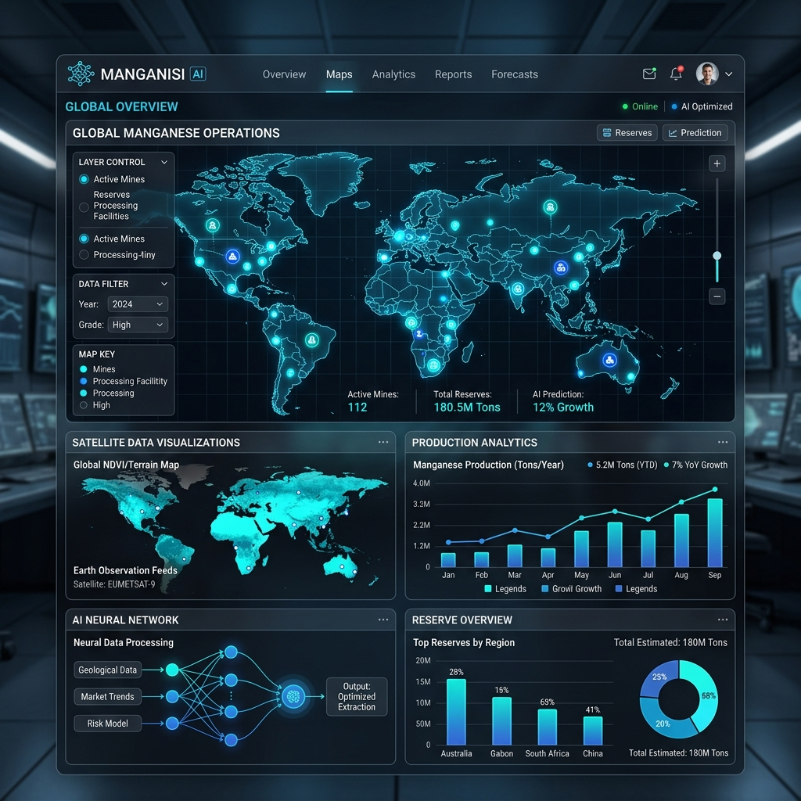

# ✦ Manganisi AI (Manganese-X | AI Core)

**Live Demo:** *(Add your deployed Vercel link here!)*

**Optimizing Global Manganese Extraction via Advanced Satellite AI.**

## Overview
Welcome to the next generation of global extraction. **Manganisi AI** (or Manganese-X) maps, analyzes, and optimizes high-purity reserves worldwide using advanced satellite AI to power tomorrow's clean energy technologies. 

Powered by public data from **ISRO and NASA**, the proprietary Manganisi Core AI identifies and analyzes high-purity manganese reserves globally to accelerate clean energy supply chains.

### Founders
- Rahul
- Lokesh

## Core Capabilities

- **🌍 Global Yield Optimization**: Optimizing extraction and tracking sites globally to ensure 1,350 T/day of high-grade ore.
- **⚡ Productivity Tracking**: Monitor and boost output of operations via AI predictions.
- **⚙️ Efficiency Logistics**: Increase operational efficiency by focusing on logistics and purity.
- **🛰️ AI Exploration Network**: Initiate deep multi-spectral scanning to detect high-priority zones using satellite data.
- **🧠 Proprietary Neural Ensemble**: Utilizes a synchronized AI ensemble (Claude for Strategy, ChatGPT for Logic, Gemini for Vision, DeepSeek for Computing) at the Manganisi Core to process terrain anomalies.

## Dashboard Views
1. **Home / Overview**: High-level KPIs, 7-day extraction trends, and operational efficiency radars.
2. **AI Exploration**: Operations console to run deep scans, view detected zones, AI match scores, and launch 3D Google Earth feeds.
3. **Global Reserves Heatmap**: Real-time data streams via ISRO plotted on an interactive 3D globe.
4. **Manganisi AI Core**: Real-time continuous logs and neural prediction vs. actual charts.

## Technologies Used
- HTML5, CSS3 (Modern, responsive, glassmorphism aesthetic)
- Vanilla JavaScript
- Leaflet.js (for 2D Mapping)
- Chart.js & ECharts (for Data Visualization and 3D Maps)
- Phosphor Icons

## Setup Instructions
1. Clone this repository.
2. Open `index.html` or `duotwin.html` in any modern web browser.
3. No build steps required! (Zero dependencies, pure frontend app).

## Partners & Integrations
- NASA API
- ISRO API
- Ore Organization of India
- World Ore Organization

---
*Developed to accelerate the clean energy supply chain.*
